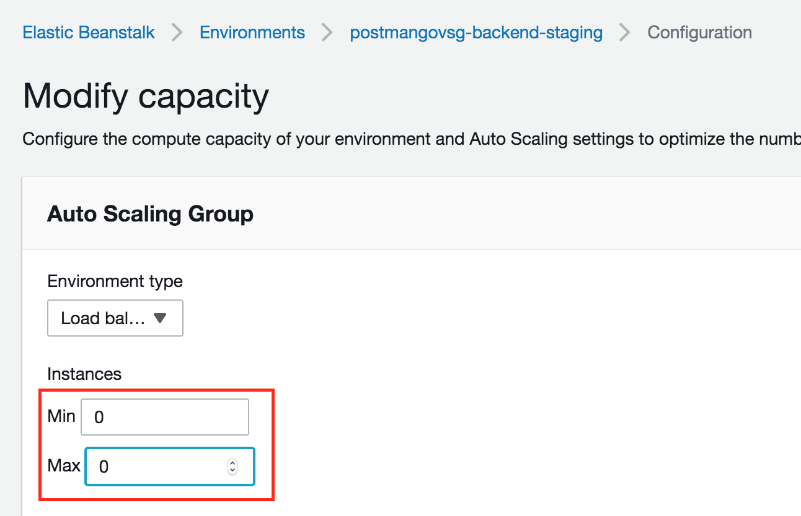
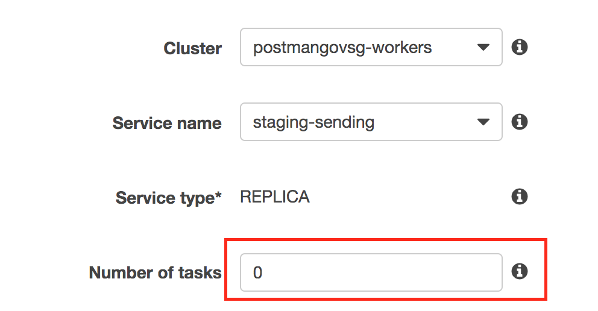

# Postman.gov.sg

- [Downtime procedure](#downtime-procedure)
  - [Bring the app down](#bring-the-app-down)
  - [Make changes to the db](#make-changes-to-the-db)
  - [Bring the app up](#bring-the-app-up)
- [How-to](#how-to)
  - [Pause pingdom](#pause-pingdom)
  - [Spin down elastic beanstalk instances](#spin-down-elastic-beanstalk-instances)
  - [Spin down ECS tasks](#spin-down-ecs-tasks)
  - [Set maintenance page on Cloudflare](#set-maintenance-page-on-cloudflare)

## Downtime procedure

### Bring the app down

- [ ] Inform users of maintenance schedule
- [ ] Check on ECS that no jobs are running
- [ ] Pause pingdom (or set a maintenance schedule)
- [ ] Put up maintenance page on cloudflare by deploying the maintenance worker to the the routes api.postman.gov.sg and postman.gov.sg
- [ ] Visit api.postman.gov.sg and postman.gov.sg and make sure the maintenance page is up
- [ ] Set your ip in elastic beanstalk load balancer security group and make sure you can hit the load balancer
- [ ] Spin down elastic beanstalk instances
- [ ] Spin down ECS tasks (sending)
- [ ] Spin down ECS tasks (logging)

### Make changes to the db

- [ ] Connect to db and record the numbers for messages, users, campaigns
- [ ] Take a snapshot of the db
- [ ] **Modify the db** (add your steps)
- [ ] Connect to db and cross check the numbers

### Bring the app up

- [ ] Spin up ECS tasks (sending)
- [ ] Spin up ECS tasks (logging)
- [ ] Spin up elastic beanstalk instances
- [ ] Hit the load balancer to make sure the app is up
- [ ] Remove your ip from load balancer security group
- [ ] Remove maintenance page from cloudflare
- [ ] Visit api.postman.gov.sg and postman.gov.sg and make sure the app is up
- [ ] Run through standard checks (login, create campaign, send)
- [ ] Start pingdom

## How-to

#### Pause pingdom

#### Spin down elastic beanstalk instances

#### Spin down ECS tasks

#### Set maintenance page on Cloudflare

