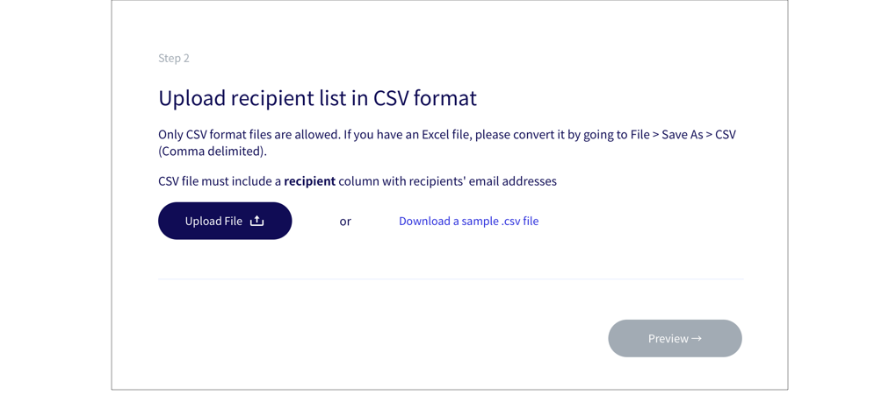

# 🚀 How to send a campaign?

### Choose the channel that fits your purpose.&#x20;

Once you are logged in, click on **Create new campaign** button, and you will be prompted with the following screen to choose your channel and fill in a campaign name.

Postman is a multi-channel messaging service that allows you to send messages through 3 channels:

* [Email](email/)
* [SMS](sms/)
* [Telegram](telegram-bot/)

However, do not that each channel has its own setup so do navigate to the specific section to find out more.&#x20;

_**Campaign name** is simply for your own record purposes, it does not appear in the email you send to the public._

Once you've chosen your channel, please follow the following steps:

### Step 1: Create a message template

<figure><figcaption></figcaption></figure>

Postman allows you to control how much each message is personalised. Message templates can be used in a few ways:

| **Message Template**                                                                                    | **Use Cases**                 |
| ------------------------------------------------------------------------------------------------------- | ----------------------------- |
| No `{{  }}`                                                                                             | Generic message for everyone  |
| Mostly standardised content with a few keywords like `{{name}}` `{{item}}` for fields that are relevant | Appointment reminder          |
| `{{keyword}}`                                                                                           | Unique message for everyone.  |


Postman has implemented **a universal footer** for all email campaigns in order to comply with [Singapore's Spam Control Act ](https://sso.agc.gov.sg/Act/SCA2007)and align with international bulk email practices ([CAN-SPAM Act](https://www.ftc.gov/tips-advice/business-center/guidance/can-spam-act-compliance-guide-business) or [EU’s ePrivacy Directive](https://ec.europa.eu/information\_society/doc/factsheets/024-privacy-and-spam-en.pdf)). Please go to our [unsubscribe page](https://guide.postman.gov.sg/guide/quick-start/email/weekly-digest-of-unsubscription) to learn more about this feature.&#x20;


### Step 2: Set up a contact list in CSV format

Most of our users have an internal database that includes all of their contacts. You can export the contact list in a CSV file. \
\
If you are not sure what to include in your CSV file, you can `Download a sample .csv file` in the step for uploading the recipient list in CSV format.&#x20;

Note the following points to ensure that the details in your CSV file are correctly displayed in your email:

* Make sure there is a field called **recipient** that will contain the phone number or email address.&#x20;
* Make sure the headers are in **lowercase.**
* Your email should be formatted like **abc@gmail.com**.
* Phone number should be formatted like **88888888** with no space, no dash, and no +65.&#x20;


_Take note to remove recipients who previously requested to unsubscribe from your communications._


### Step 3: Send your campaign

You can test the message by sending it to yourself. When you are satisfied with it, go ahead and send your campaign.

## Remove Duplicates in Excel


Postman does not remove duplicates for recipients in view of some use cases that require sending unique messages to the same individual multiple times. **Scroll down** to the [**Remove Duplicates in Excel** ](https://guide.postman.gov.sg/quick-start#remove-duplicates-in-excel)section to find out how to remove duplicates in excel**.**&#x20;


Select your data > go to **Data** > **Remove duplicates** > **select all columns** > click **OK.**

For comprehensive instruction on duplicate removal, please go to [Microsoft Excel Support Page](https://support.microsoft.com/en-us/office/find-and-remove-duplicates-00e35bea-b46a-4d5d-b28e-66a552dc138d).&#x20;

