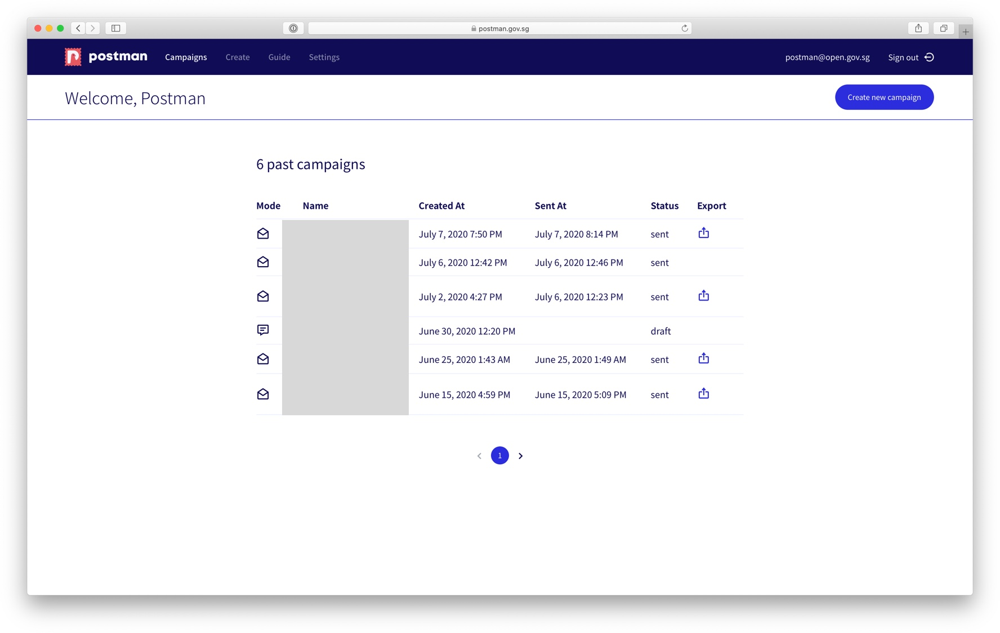
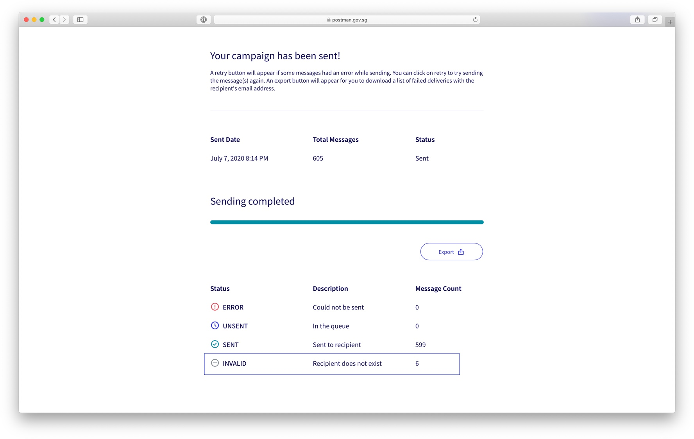
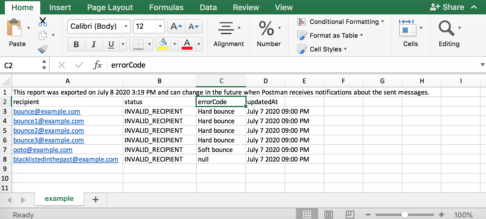

# Email Statistics

The campaign dashboard shows you all the campaigns that you have sent in the past. Campaigns with an export button mean that there are errors or invalid emails in that particular campaign.

You can click into your campaign to see the breakdown of the summary stats. &#x20;

## Types of Status for Email

Email campaigns would generate two types of status:


1. **SENT**:  Your email was successfully delivered to the recipient
   * In your campaign delivery report, the status for successfully delivered emails will read “success”. If recipients have already opened the emails, the status will be “read”.
2. **INVALID**: The email address was not valid. It could be a [soft or hard bounce](https://guide.postman.gov.sg/guide/quick-start/email/halting-of-email-campaigns#what-are-the-different-kinds-of-bounce).


You generally would not have any **ERROR** status. To see the entire list of invalid emails, you need to click on the `Export` button.&#x20;

Once you click on the `Export` button, you will get a CSV file with the following columns.&#x20;

| Error Codes                                                                                                                               | Description & Follow-up Action                                                                                                                                                                                                                                                                                                                                                                                                                                                                                                                                                                                                                                                                                                                   |
| ----------------------------------------------------------------------------------------------------------------------------------------- | ------------------------------------------------------------------------------------------------------------------------------------------------------------------------------------------------------------------------------------------------------------------------------------------------------------------------------------------------------------------------------------------------------------------------------------------------------------------------------------------------------------------------------------------------------------------------------------------------------------------------------------------------------------------------------------------------------------------------------------------------ |
| **Blacklisted**                                                                                                                           | 
The email recipient is not valid and might not exist. You have sent emails to this invalid email address before and we have added this email address to PostmanSG's blocklist given that the email address is invalid.

<strong>Action</strong>: Please remove this email address from your contact list. If you think this email address is blacklisted mistakenly, please contact us.
                                                                                                                                                                                                                                                                                                                                       |
| [**Hard bounce**](https://guide.postman.gov.sg/guide/quick-start/email/halting-of-email-campaigns#what-are-the-different-kinds-of-bounce) | 
These are <a href="https://guide.postman.gov.sg/guide/quick-start/email/halting-of-email-campaigns#what-are-the-different-kinds-of-bounce">hard bounces</a> and they are invalid emails. No real human is using these email addresses. The email recipient is not valid and might not exist. We will be adding this recipient to our blacklist and we will not send emails to this recipient again for any future campaign.

<strong>Action</strong>: Please remove this email address from your contact list.

<strong>Note</strong>: email distribution lists (i.e. group email addresses) will also be hard bounced. <strong>Action:</strong> please use individual email addresses in the CSV recipient list.
 |
| [**Soft bounce**](https://guide.postman.gov.sg/guide/quick-start/email/halting-of-email-campaigns#what-are-the-different-kinds-of-bounce) | 
The email inbox might be full or the person might have an out-of-office message.

 <strong>Action</strong>: None. You can continue to send emails to these recipients in the subsequent campaign. 

                                                                                                                                                                                                                                                                                                                                                                                                                                                                                                                         |
| **Error**                                                                                                                                 | 
Incorrect email formatting. Please check for typo, space, and symbols and amend this email address.

<strong>Action</strong>: Check for typo, space, and symbols in the recipient field and amend the email address. 
                                                                                                                                                                                                                                                                                                                                                                                                                                                                                                         |

