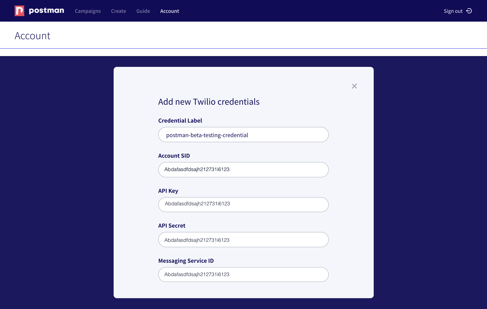
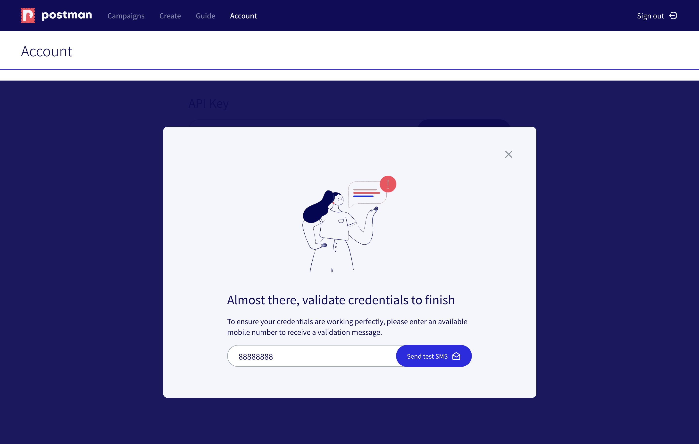
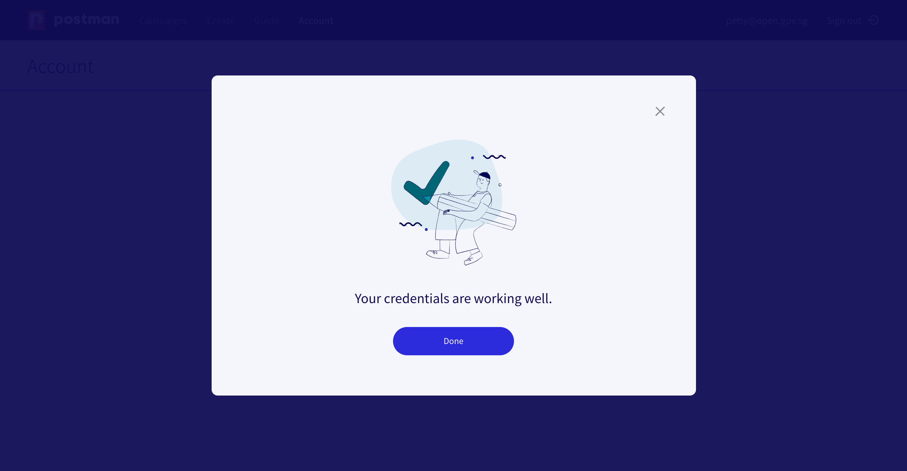
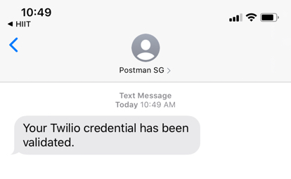

# Add Twilio Credentials in Postman



## Save your Twilio credentials under Settings in Postman

Think of credentials as a passcode that you need to enter into a keypad in order to get into a door. We need your credentials to contact Telegram's API. If you want to be able to reuse your credentials, you need to save them under settings.&#x20;

### Step 1: Go to Settings on your Postman dashboard

<figure><figcaption></figcaption></figure>

### Step 2: Add in your Twilio credentials

**Credential Label** is just a friendly name for your to keep a record of this credentials.&#x20;

You will need 4 credentials from Twilio:

* **Account SID**, read how to find it [here](https://guide.postman.gov.sg/quick-start/sms/set-up-twilio-account#how-to-find-account-sid)
* **API Key & API Secret** read how to find them [here](https://guide.postman.gov.sg/quick-start/sms/set-up-twilio-account#how-to-find-account-sid)
* **Messaging Service ID**, find it [here](https://guide.postman.gov.sg/quick-start/sms/set-up-twilio-account#step-6-get-your-messaging-service-id)

### Step 3: Put in your mobile number to validate your credentials

Receive a success message once your credentials have been validated.

An SMS will also be sent to your mobile number.

You can go back to **Campaigns** to start sending your SMS. The testing message page will have a drop-down menu for you to select the credentials that you have saved in Accounts. You can also choose to enter a new set of credentials under the campaign. The credentials entered for the campaign are only specific to that particular campaign. It **will not be saved**.

## Remove your credentials

There is no preview for the credentials saved yet. Remove your credential by clicking on the trash icon.&#x20;


**Deleting your credentials is irreversible.** We will prompt you to make sure that it is the right credential that you want to delete.&#x20;

