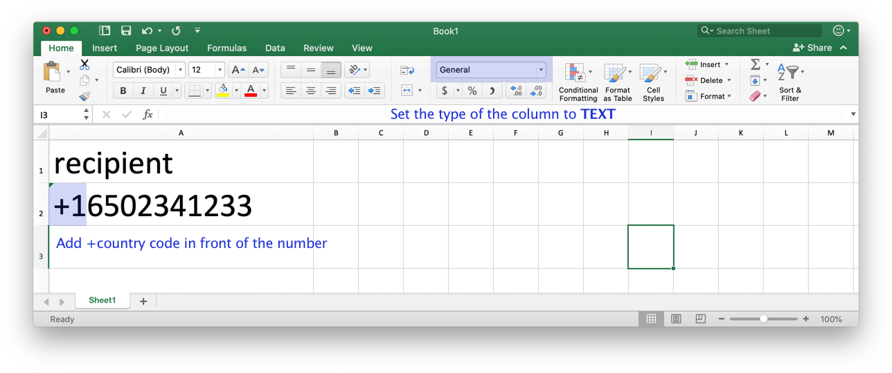

# Sending an SMS to a Foreign Number

Postman will add the +65 for you automatically when you enter the eight-digit phone number for a Singapore phone number. If you wish to send SMS to an overseas number, you need to change your excel column type to `Text` and add +country code in front of the number to send the SMS internationally. Once you have added the +, press `save` and you will be able to upload the file to send SMS to foreign numbers.&#x20;

If you are having trouble editing your CSV file, you can open the CSV file using any text editor and add in the + for the phone number and press `save`.&#x20;

In some versions of Excel, the + might disappear when you open the CSV file again. If the + disappears, do not save the file again. Try opening your file using a text editor to check if the + is still present in the file.&#x20;
