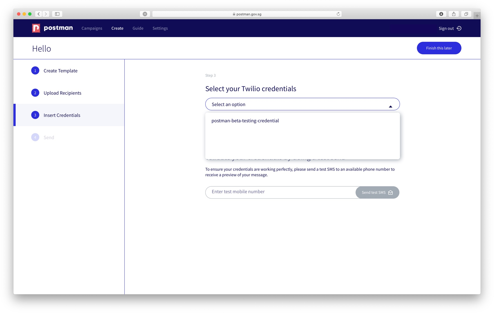

# Use your Saved SMS Credentials

The SMS user experience is exactly the same as [email](https://guide.postman.gov.sg/quick-start). Once you have saved your Twilio SMS credentials under settings, you can choose the credentials from the dropdown list when it prompts you to insert credentials.&#x20;

If you are sending official links from a gov.sg domain, and the links are informational (no transactions can be made), [Method 2 on this page](https://guide.postman.gov.sg/quick-start/email/unique-url-link-per-recipient) will also show you how this can be done.

