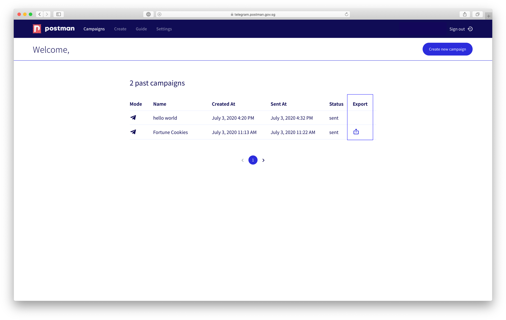
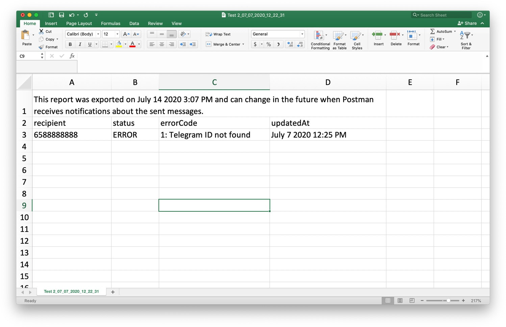

# Telegram Bot Statistics

You can download the list of Telegram recipients that failed to send on the stats page once the campaign is completed. See `export icon`.

## Types of Status for Telegram Bot

Telegram Bot campaigns would generate two types of status:


1. **SENT**: Your Telegram message was sent successfully.
2. **ERROR**: Your Telegram message has failed to send.


You would not have any **INVALID** status (invalid status is for only for email). To see the entire list of errors you need to click on the `Export` button.

.jpg>)

Once you click on the `Export` button, you will get a CSV file with the following columns.

| Error Codes                       | Description & Follow-up Action                                                                                                                                                                                                                                                                                                                                                              |
| --------------------------------- | ------------------------------------------------------------------------------------------------------------------------------------------------------------------------------------------------------------------------------------------------------------------------------------------------------------------------------------------------------------------------------------------- |
| **1: Telegram ID not found**      | 
Your recipient has not subscribed to your bot.  <strong>Action</strong>: You need to ask your recipient to follow the <a href="https://guide.postman.gov.sg/guide/quick-start/telegram-bot/instructions-recipient-telegram">Instructions for Recipient Onboarding</a> to subscribe to your bot.
                                                                                |
| **2: Bot subscription not found** | 
Your recipient has subscribed to one of our many agency bots on Postman but he or she is not subscribed to your agency's bot.  <strong>Action</strong>: You need to ask your recipient to follow the <a href="https://guide.postman.gov.sg/guide/quick-start/telegram-bot/instructions-recipient-telegram">Instructions for Recipient Onboarding</a> to subscribe to your bot.
 |
