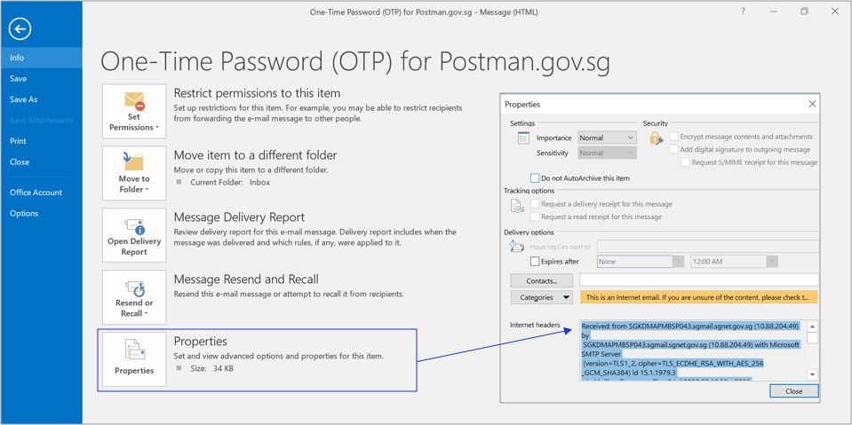
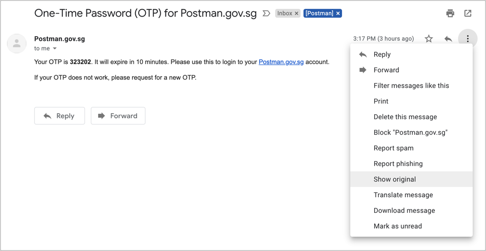
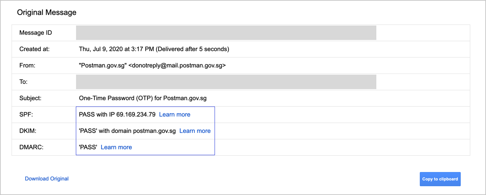

# Check Email Authenticity

If you are not sure about the authenticity of the email you received from PostmanSG, you can check your email header.&#x20;

## Outlook

If you are using Outlook, you can go to **File > Properties > Internet headers.**&#x20;

.png>)

What you want to see is the part of the header that shows the **authentication results**. You should be able to find something like this (see below).  &#x20;


**Authentication-Results**:\
spf=**pass** smtp.mailfrom=<`someuniquemessageid`>[@mail.postman.gov.sg](mailto:010001732fa75c8d-6f7b6c04-ec03-4b1e-820b-9bf34a69d10c-000000@mail.postman.gov.sg); \
dkim=**pass** (signature verified) header.i=@[mail.postman.gov.sg](http://mail.postman.gov.sg/); \
dmarc=**pass** (p=none dis=none) d=[postman.gov.sg](http://postman.gov.sg/)


## Gmail

In Gmail, you need to go to **show original** to check the SPF, DKIM, and DMARC records.&#x20;

