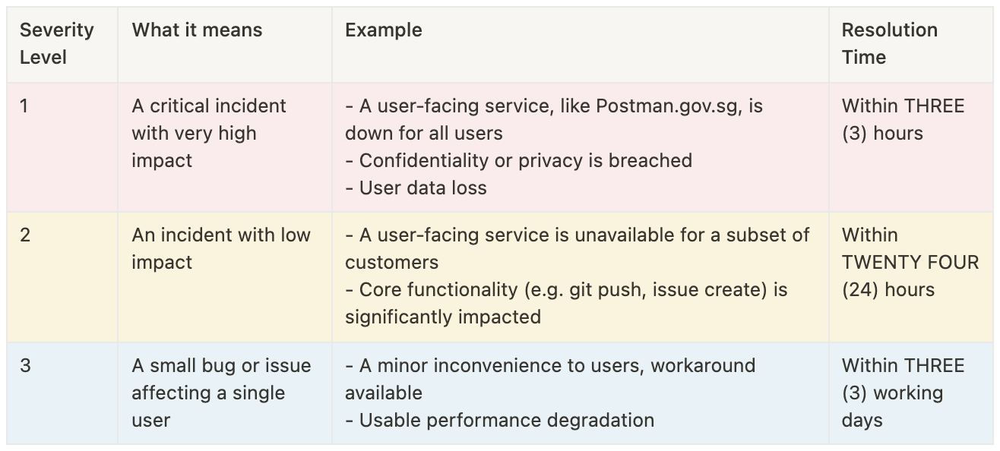

# Postman Uptime

## In-house Monitoring

We have internal services to monitor Postman uptime 24/7. These services send alerts if the product is down to the engineer-on-call, so that we can respond as soon as possible.

However, if you face specific or isolated issues, please report them to us [here](https://go.gov.sg/postman-contact-us).&#x20;

## Subscribe to Status Updates

If you are unable to access Postman services and would like to check if it is due to an unplanned downtime, check our status page [here](https://status.postman.gov.sg/). You can also subscribe yourself to email notifications.

Relatedly, you might also wish to check [Twilio status page](https://status.twilio.com/) and [AWS status page](https://status.aws.amazon.com/) if you're experiencing an unplanned incident.

Typically, we inform users of downtime only if resolution is expected to take longer than a day, or if your campaign is directly affected.

## Postman SLAs

Usually, if there is product downtime, we immediately work towards getting the service back up and running as soon as we can. We generally abide by these guidelines:

<figure><figcaption></figcaption></figure>

##
